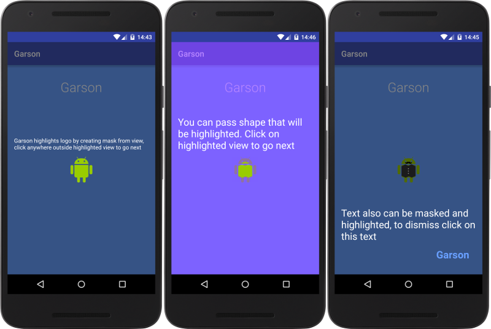

Garson
---
... at your service!

The android library to tip / highlight parts of your layout.
Just like that:



How to use:
---
- Highlight view
```java
Garson.in(MainActivity.this)
       .with("I'm at your service, sir!")
       .tip(viewToHighlight);
```
-
- More in sample

TODOs
---
- Points to extend/customize tips ui (text positioning, content instead of text, highlight options, something else...)
- Api to chain several Garsons' objs in appropriate conditional/eventual order
- Tests